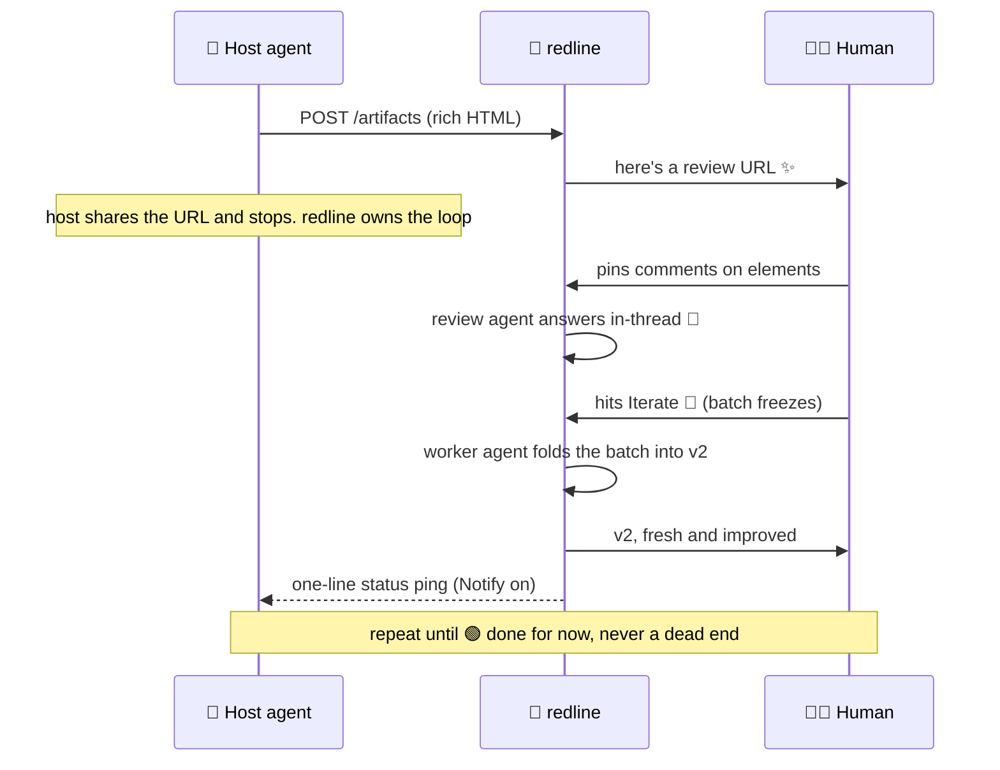

# 📌 redline - ~~Because sometimes~~ markdown ~~just ain't~~ is not enough

   

Your AI agent just designed your entire system architecture, mocked up your new dashboard, and pitched a robot barista for the office. In beautiful HTML. In four seconds flat.

Now what? 🤨

You could screenshot it into Slack and type *"the box near the middle, second from the left. That one. Make it better."* You could squint at source code like a Victorian surgeon. You could ask the agent to "incorporate feedback" and pray.

**Or you could redline it.** ✨

redline is a local review server for *anything your agent can render*: 🖥️ UI mockups, 🏗️ architecture docs, 📋 decision records, 📜 API contracts, 🔀 data flows, 📊 diagrams, 💡 concepts, 🗺️ plans, 🚀 that idea you had in the shower. Your agent publishes an artifact. You pin comments on the exact elements that bother you (headings, diagrams, tables, buttons, embedded UI). redline's review agent answers *live in the thread*. When the batch feels right, you hit **Iterate**: the feedback freezes, the worker agent folds it all into a new version, and the loop repeats. **Approve** means *done for now*. The artifact stays open, always iterable. 🔄

Google Docs comments. Figma pins. Except the document is written by your agent, the review loop drives itself, and nothing ever leaves your machine. 🏠

## 😍 Look at it go

<video src="https://raw.githubusercontent.com/codenamegary/redline/main/docs/redline-demo.mp4" controls muted playsinline preload="metadata" width="100%"></video>

*Rendered with [Remotion](demo/remotion)*

## 🔁 The loop



### 🤖🤖 The agents

redline runs its own agents. The **review agent** answers your comments in the thread. The **worker agent** takes Iterate and produces the next version itself. Wire them up at `/settings` (ACP or OpenCode SDK). ACP presets: OpenCode, Cursor Agent (`~/.local/bin/agent acp`), Claude Code, Gemini, Codex. The model field applies only to `opencode-sdk`. On ACP, bake model flags into a custom command.

With **Notify** on, the server drops a one-line status into the OpenCode session that created the artifact after each duty (`replied to 2 thread(s)…`, `published v3 of…`, `v3 approved. Done for now.`). Status only. One line. Never a thread dump.

## ⚡ Quick start

Every path ends at the same local daemon under `~/.redline`.

### Claude Code, Cursor, Antigravity

```bash
npx skills add codenamegary/redline
```

Then ask your agent something like:

> Redline a dashboard mockup for our billing settings page.

The skill bootstraps the daemon on first use. Skill updates: `npx skills update`.

### pi

```bash
pi install git:github.com/codenamegary/redline
```

Reload pi (`/reload`). First tool call starts the daemon.

### OpenCode

```bash
curl -fsSL https://raw.githubusercontent.com/codenamegary/redline/main/install.sh | bash -s -- --with-opencode
```

Restart OpenCode sessions. First tool call starts the daemon.

### Daemon only

```bash
curl -fsSL https://raw.githubusercontent.com/codenamegary/redline/main/install.sh | bash
```

| Source | Keys |
|--------|------|
| Environment | `REDLINE_PORT`, `REDLINE_HOST`, `REDLINE_HOME` |
| Defaults | `4739`, `127.0.0.1`, `~/.redline` |

## 🎁 What you get

- 📌 **Pin comments on anything.** Headings, paragraphs, diagrams, tables, buttons, whole embedded UIs. If HTML can render it, you can redline it. That means *everything*.
- 💬 **Threads, not sticky notes.** Replies, resolve/reopen, and `author: "user" | "agent"`. Your agent can answer your questions *in the thread* before touching the document. Comment while the agent is attached and it instantly shows a 🌀 *thinking…* placeholder, then its real answer. Like a coworker who's suspiciously fast and never sighs.
- 🕰️ **History is sacred.** Every revision kept. Every version is the record of one iteration: the batch of threads it addressed, when it was published, when you approved it. Every thread records the version it was pinned on (`anchorVersion`) and the version that resolved it (`resolvedInVersion`). Old pins stay visible. The UI badges them so nothing gaslights you.
- ⚡ **A loop that runs itself. Your chat stays free.** The review agent answers your comments in the thread. The worker agent takes Iterate and produces the next version. Approve and both agents step back (done for now). The server enforces the split: publishing outside `iterating` is a 409, so live replies are always consequence-free. With Notify on, the origin session gets a one-line status after each duty. No cron. No refresh spam. No "checking if the agent saw my feedback" anxiety spiral.
- 🗂️ **The filesystem is the database.** Plain JSON + HTML under `~/.redline`. No migrations, no volumes, no vendor. `grep` your own feedback. `diff` two versions. Back it up with `cp`. Radical, we know.
- 🔌 **Any harness, any agent.** Claude Code / Cursor / Antigravity via the skill. Cursor Agent also works as an ACP preset at `/settings`. Native tools for pi and OpenCode. Or raw HTTP. Eighteen endpoints. `curl` works too.
- 🏠 **Localhost or nothing.** No cloud. No accounts. No telemetry. No "workspace". Your design docs never leave your disk, which is where your stuff lived before anyone decided it shouldn't.

## 📁 On disk

```
~/.redline/
├── server.log                      # daemon output
├── settings.json                   # review agent, worker agent, notify (edit via /settings)
├── app/                            # self-managed copy of redline (created by install.sh)
└── artifacts/
    └── 2026-01-15-143205-dashboard/
        ├── meta.json               # title, prompt, status, version ledger
        ├── v1-index.html           # self-contained artifact versions
        ├── v1-feedback.json        # comment threads, stored per version
        ├── v2-index.html
        └── v2-feedback.json
```

That's the whole kingdom. 👑

## 🧪 API

Standards: Richardson Level 2, camelCase JSON, ISO 8601 UTC timestamps, RFC 7807 problem details on errors. Yes, someone read the docs. See `docs/api-standards.md`.

| Method | Path | Purpose |
|--------|------|---------|
| GET | `/api/v1/health` | liveness + home path |
| GET | `/api/v1/artifacts` | list summaries (status, versions, open threads, review URL) |
| POST | `/api/v1/artifacts` | create with `{title, html, prompt?, note?, origin?}` → 201 + Location, status `review` |
| GET | `/api/v1/artifacts/:id` | detail incl. prompt, `iteratedAt`, and the version ledger |
| GET | `/api/v1/artifacts/:id/worker` | debug: configured vs live review and worker agents, plus stored `origin` |
| POST | `/api/v1/artifacts/:id/iterations` | hit Iterate: freezes open threads into a pending version, status `iterating` (409 unless `review`, 422 with nothing open) |
| POST | `/api/v1/artifacts/:id/versions` | publish the pending iteration `{html, note?}` → becomes current, status `review` (409 unless `iterating`) |
| POST | `/api/v1/artifacts/:id/versions/:version/approve` | done for now: stamps `approvedAt` on the current version (409 while iterating) |
| GET | `/api/v1/artifacts/:id/feedback` | all threads artifact-scoped, newest first, plus `agentAttached`, `iteratedAt`, `approvedAt`, version ledger. `?version=` filters to threads pinned on that version. Long-poll `?after=<iso>&wait=<seconds>` (max 300) |
| POST | `/api/v1/artifacts/:id/feedback` | new thread `{body, anchor?, version?, author?}` (409 while iterating) |
| POST | `/api/v1/artifacts/:id/threads/:threadId/messages` | reply `{body, author?}`, always allowed. User replies while the agent is attached get a `thinking` placeholder |
| PATCH | `/api/v1/artifacts/:id/threads/:threadId/messages/:messageId` | replace a `thinking` placeholder with the real reply |
| PATCH | `/api/v1/artifacts/:id/threads/:threadId` | `{status}`: `open` or `resolved` (409 while iterating) |
| GET | `/api/v1/settings` | effective agent config (`reviewer`, `worker`) and prompt templates |
| PUT | `/api/v1/settings` | save settings. Probes every configured agent first, 400 problem+json with detail on failure |
| POST | `/api/v1/settings/probe` | test one agent `{lane, adapter, acpCommand}` (422 with detail on failure) |
| POST | `/api/v1/settings/prompts/reset` | restore the shipped prompt templates, returns effective settings |
| GET | `/api/v1/settings/defaults` | the shipped prompt templates |

The create body takes an optional `origin` `{host, sessionId, serverUrl?}`. The plugins send it automatically. With Notify on (see `/settings`), the server posts a one-line status into that session after a duty (replies, publishes, worker failures, approvals). Only the OpenCode SDK adapter can notify today, and only when the artifact has an origin.

Pages (not part of the JSON API):

| Path | Purpose |
|------|---------|
| `/` | gallery of all artifacts |
| `/settings` | review agent, worker agent, and notify |
| `/a/:id` | review shell (feedback sidebar + iframe) |
| `/a/:id/:version/*` | raw artifact files. `current` resolves to the latest version |

Threads are artifact-scoped even though they're stored per version. Open threads surface first no matter which version they were pinned on. `?version=vN` filters to a specific version's pins. Messages carry a `kind`: `text` or `thinking`. `thinking` is the server-synthesized placeholder the agent replaces with its real answer (the only editable message). The worker agent also posts ordinary agent `text` notes on batch threads (`Working on this for vN.`, `Addressed in vN.`, `Worker failed: …`). Those are status, not new pins. The loop's statuses are server-owned: `draft`, `review`, `iterating`. Approval is not one of them. It's an `approvedAt` stamp on a version row, alongside the frozen `batch` of thread ids that iteration addressed. Artifacts should be single-file HTML: inline CSS and JS, no network dependencies, stable `id` attributes on major sections so pins survive revisions. The skill teaches your agent all of this, so ideally you never have to think about it. 😌

## 🧭 Principles

- **Feedback should be structured.** Anchors with selectors, not screenshots with arrows drawn on them. Machine-readable critique that agents can actually act on.
- **The review loop drives itself.** You annotate → the review agent answers → you hit Iterate → the worker agent publishes the batch as a version → repeat. You do judgment. redline does everything else. Division of labor! 💼
- **Conversation and construction are different jobs.** Comments go to the review agent. Only Iterate wakes the worker agent. The server makes the rule, so nobody has to remember it.
- **Nothing disappears.** Versions are immutable, threads are anchored, resolutions are stamped, approvals live on the version that earned them. Your review history is a first-class artifact.
- **Zero ceremony.** No sign-up, no API keys, no seat count, no onboarding webinar. It's a local server with eighteen endpoints. It starts when you need it and shuts up when you don't. 🤫

## 🛠️ Development

```bash
git clone https://github.com/codenamegary/redline.git && cd redline
bash install.sh --with-pi --with-opencode   # optional harness wiring
bun run check          # lint + typecheck + test
bun run lint           # oxlint --deny-warnings
bun run typecheck      # tsc --noEmit
bun test               # bun test runner
```

Node 22+ works too: `npx tsx src/main.ts serve` (the npm `bin` entry uses tsx). Runtime dependencies: fastify, zod, typebox.

## 🗺️ Roadmap

- Optional MCP adapter over the same HTTP API for other harnesses
- Sketch markup and screenshot attachments on threads

## 📄 License

MIT. Do what you like. **Redline responsibly.** 🔴
