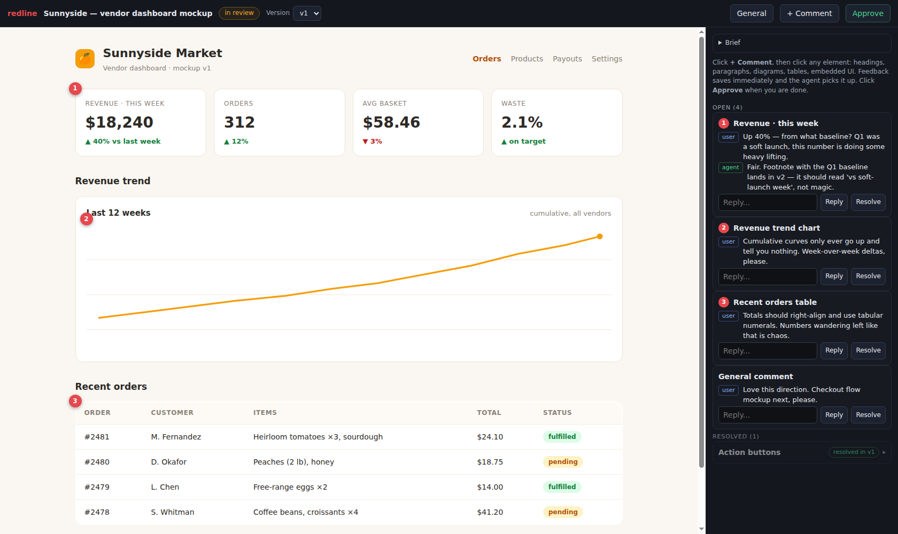
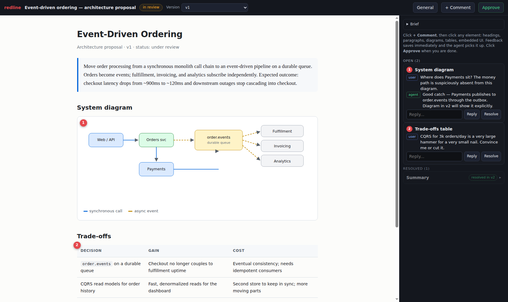
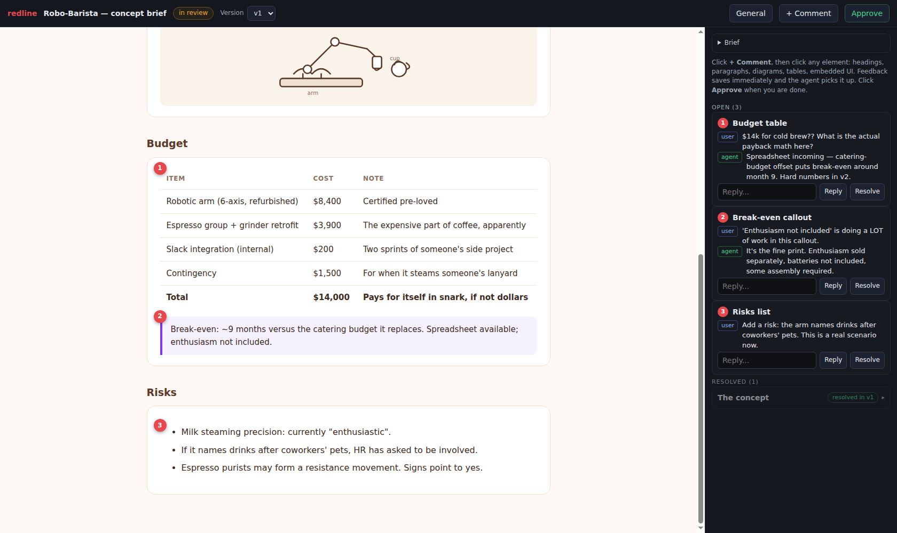
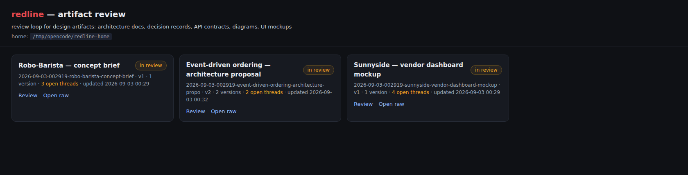
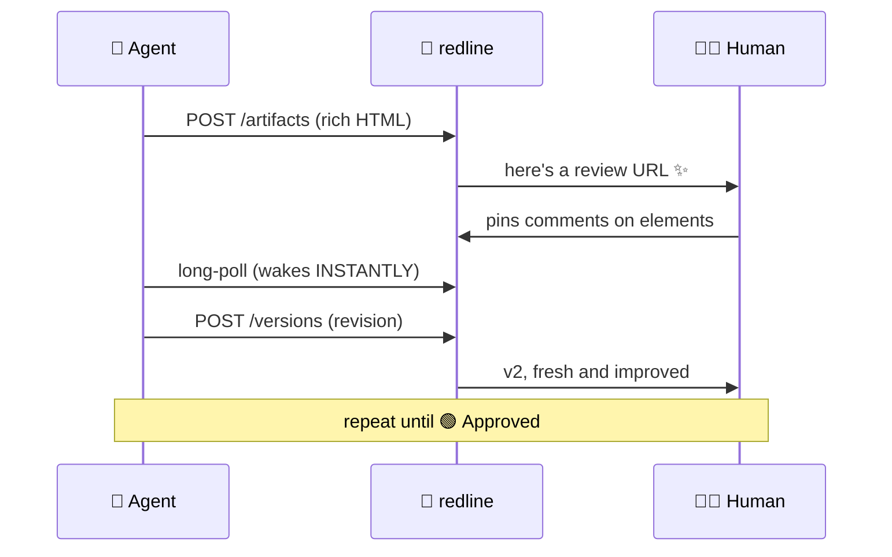

# 📌 redline

**The agent renders. The human redlines.** 🔴

   

Your AI agent just designed your entire system architecture, mocked up your new dashboard, and pitched a robot barista for the office. In beautiful HTML. In four seconds flat.

Now what? 🤨

You could screenshot it into Slack and type *"the box near the middle, second from the left — that one, make it better."* You could squint at source code like a Victorian surgeon. You could ask the agent to "incorporate feedback" and pray.

**Or you could redline it.** ✨

redline is a local review server for *anything your agent can render*: 🖥️ UI mockups, 🏗️ architecture docs, 📋 decision records, 📜 API contracts, 🔀 data flows, 📊 diagrams, 💡 concepts, 🗺️ plans, 🚀 that idea you had in the shower. Your agent publishes an artifact, you pin comments on the exact elements that bother you — headings, diagrams, tables, buttons, embedded UI — and the agent reads your structured feedback back over a tiny HTTP API, revises, and does it all again until you hit **Approve**.

Google Docs comments. Figma pins. Except the document is written by your agent, the review loop drives itself, and nothing ever leaves your machine. 🏠

## 😍 Look at it go

The review shell — your artifact on the left, pinned threads on the right, numbered pins exactly where you clicked:



Redlining an architecture proposal while the agent answers questions *inside the thread* (note `resolved in v2` — threads survive revisions, because they should):



Yes, you can review *plans and ideas* too. This is a real concept brief for a $14,000 robot barista, receiving the scrutiny it deserves:



And a gallery of everything awaiting your judgment:



## 🔁 The loop



Four verbs. Endless patience. Zero meetings. 🪄

## ⚡ Quick start

Every path ends at the same local daemon under `~/.redline`.

### Claude Code, Cursor, Antigravity

```bash
npx skills add codenamegary/redline
```

Then ask your agent something like:

> Redline a dashboard mockup for our billing settings page.

The skill bootstraps the daemon on first use. Skill updates: `npx skills update`.

### pi

```bash
pi install git:github.com/codenamegary/redline
```

Reload pi (`/reload`). First tool call starts the daemon.

### OpenCode

```bash
curl -fsSL https://raw.githubusercontent.com/codenamegary/redline/main/install.sh | bash -s -- --with-opencode
```

Restart OpenCode sessions. First tool call starts the daemon.

### Daemon only

```bash
curl -fsSL https://raw.githubusercontent.com/codenamegary/redline/main/install.sh | bash
```

| Source | Keys |
|--------|------|
| Environment | `REDLINE_PORT`, `REDLINE_HOST`, `REDLINE_HOME` |
| Defaults | `4739`, `127.0.0.1`, `~/.redline` |

## 🎁 What you get

- 📌 **Pin comments on anything.** Headings, paragraphs, diagrams, tables, buttons, whole embedded UIs. If HTML can render it, you can redline it — which means *everything*.
- 💬 **Threads, not sticky notes.** Replies, resolve/reopen, and `author: "user" | "agent"` — so your agent can answer your questions *in the thread* before touching the document. Like a coworker who's suspiciously fast and never sighs.
- 🕰️ **History is sacred.** Every revision kept. Every thread records the version it was pinned on (`anchorVersion`) and the version that resolved it (`resolvedInVersion`). Old pins stay visible — the UI badges them so nothing gaslights you.
- ⚡ **Long-polling that actually wakes up.** The agent blocks on `wait`, and the moment you comment or approve, it springs into action. No cron. No refresh spam. No "checking if the agent saw my feedback" anxiety spiral.
- 🗂️ **The filesystem is the database.** Plain JSON + HTML under `~/.redline`. No migrations, no volumes, no vendor. `grep` your own feedback. `diff` two versions. Back it up with `cp`. Radical, we know.
- 🔌 **Any harness, any agent.** Claude Code / Cursor / Antigravity via the skill. Native tools for pi and OpenCode. Or raw HTTP — ten endpoints. `curl` works too.
- 🏠 **Localhost or nothing.** No cloud. No accounts. No telemetry. No "workspace". Your design docs never leave your disk, which is where your stuff lived before anyone decided it shouldn't.

## 📁 On disk

```
~/.redline/
├── server.json                     # pid + port of the running daemon
├── server.log                      # daemon output
├── app/                            # self-managed copy of redline (created by install.sh)
└── artifacts/
    └── 2026-01-15-143205-dashboard/
        ├── meta.json               # title, prompt, status, versions
        ├── v1/index.html           # self-contained artifact versions
        ├── v2/index.html
        └── feedback/
            ├── v1.json             # comment threads, stored per version
            └── v2.json
```

That's the whole kingdom. 👑

## 🧪 API

Standards: Richardson Level 2, camelCase JSON, ISO 8601 UTC timestamps, RFC 7807 problem details on errors. Yes, someone read the docs. See `docs/api-standards.md`.

| Method | Path | Purpose |
|--------|------|---------|
| GET | `/api/v1/health` | liveness + home path |
| GET | `/api/v1/artifacts` | list summaries (status, versions, open threads, review URL) |
| POST | `/api/v1/artifacts` | create with `{title, html, prompt?, note?}` → 201 + Location |
| GET | `/api/v1/artifacts/:id` | detail incl. prompt and version list |
| PATCH | `/api/v1/artifacts/:id` | `{status}`: `draft`, `review`, or `approved` |
| POST | `/api/v1/artifacts/:id/versions` | add revision `{html, note?}` → becomes current, status `review` |
| GET | `/api/v1/artifacts/:id/feedback` | all threads artifact-scoped, open first; `?version=` filters to threads pinned on that version; long-poll `?after=<iso>&wait=<seconds>` (max 300) |
| POST | `/api/v1/artifacts/:id/feedback` | new thread `{body, anchor?, version?, author?}` |
| POST | `/api/v1/artifacts/:id/threads/:threadId/messages` | reply `{body, author?}` |
| PATCH | `/api/v1/artifacts/:id/threads/:threadId` | `{status}`: `open` or `resolved` |

Pages (not part of the JSON API):

| Path | Purpose |
|------|---------|
| `/` | gallery of all artifacts |
| `/a/:id` | review shell (feedback sidebar + iframe) |
| `/a/:id/:version/*` | raw artifact files; `current` resolves to the latest version |

Threads are artifact-scoped even though they're stored per version — open threads surface first no matter which version they were pinned on, and `?version=vN` filters to a specific version's pins. Artifacts should be single-file HTML: inline CSS and JS, no network dependencies, stable `id` attributes on major sections so pins survive revisions. The skill teaches your agent all of this, so ideally you never have to think about it. 😌

## 🧭 Principles

- **Feedback should be structured.** Anchors with selectors, not screenshots with arrows drawn on them. Machine-readable critique that agents can actually act on.
- **The review loop drives itself.** Agent publishes → you annotate → agent wakes → agent revises → repeat → Approve. You do judgment; the agent does everything else. Division of labor! 💼
- **Nothing disappears.** Versions are immutable, threads are anchored, resolutions are stamped. Your review history is a first-class artifact.
- **Zero ceremony.** No sign-up, no API keys, no seat count, no onboarding webinar. It's a local server with ten endpoints. It starts when you need it and shuts up when you don't. 🤫

## 🛠️ Development

```bash
git clone https://github.com/codenamegary/redline.git && cd redline
bash install.sh --with-pi --with-opencode   # optional harness wiring
bun run check          # lint + typecheck + test
bun run lint           # oxlint --deny-warnings
bun run typecheck      # tsc --noEmit
bun test               # bun test runner
```

Node 22+ works too: `npx tsx src/main.ts serve` (the npm `bin` entry uses tsx). Runtime dependencies: fastify, zod, typebox.

## 🗺️ Roadmap

- Optional MCP adapter over the same HTTP API for other harnesses
- Sketch markup and screenshot attachments on threads

## 📄 License

MIT. Do what you like. **Redline responsibly.** 🔴
